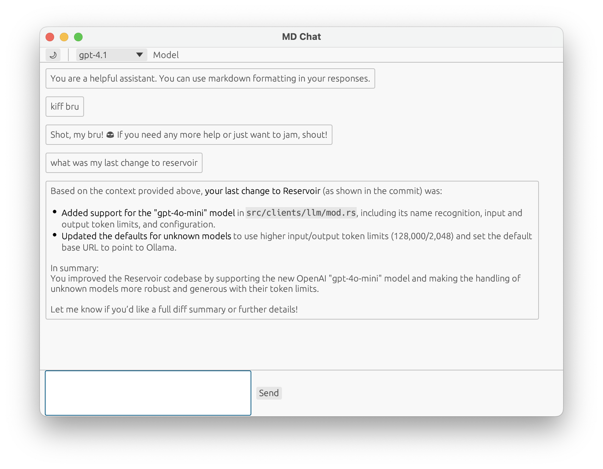

# MD-Chat

A lightweight, fast desktop client for experimenting with OpenAI-compatible APIs. Built with [egui](https://github.com/emilk/egui) for native performance and [CommonMark](https://commonmark.org/) support.



## Features

- 🚀 Fast native performance with egui
- 📝 Full Markdown rendering support
- 🌓 Light/Dark mode toggle
- 💾 Persistent window position
- 🔄 Compatible with OpenAI and similar APIs (like Reservoir)
- 🎨 Clean, minimal interface

## Configuration

The application uses environment variables for configuration:

```bash
# Required: Your API key
export OPENAI_API_KEY="your-api-key"

# Optional: Custom API endpoint (defaults to OpenAI)
export OPENAI_API_URL="https://your-api-endpoint/v1/chat/completions"
```

## Building and Running

```bash
# Build the application
cargo build --release

# Run the application
cargo run --release
```

## Usage

1. Configure your environment variables
2. Launch the application
3. Type your message in the input box
4. Press Enter or click Send to submit
5. View the markdown-formatted response

## Development

The codebase is organized into two main components:

- `src/main.rs`: UI and application logic
- `src/openai.rs`: API client implementation

## Dependencies

- eframe: Egui framework for native applications
- egui_commonmark: Markdown rendering support
- reqwest: HTTP client
- tokio: Async runtime
- serde: Serialization/deserialization

## License

Licensed under the Apache License, Version 2.0 (the "License"); you may not use this code except in compliance with the License. You may obtain a copy of the License at

http://www.apache.org/licenses/LICENSE-2.0

Unless required by applicable law or agreed to in writing, software distributed under the License is distributed on an "AS IS" BASIS, WITHOUT WARRANTIES OR CONDITIONS OF ANY KIND, either express or implied. See the License for the specific language governing permissions and limitations under the License. 