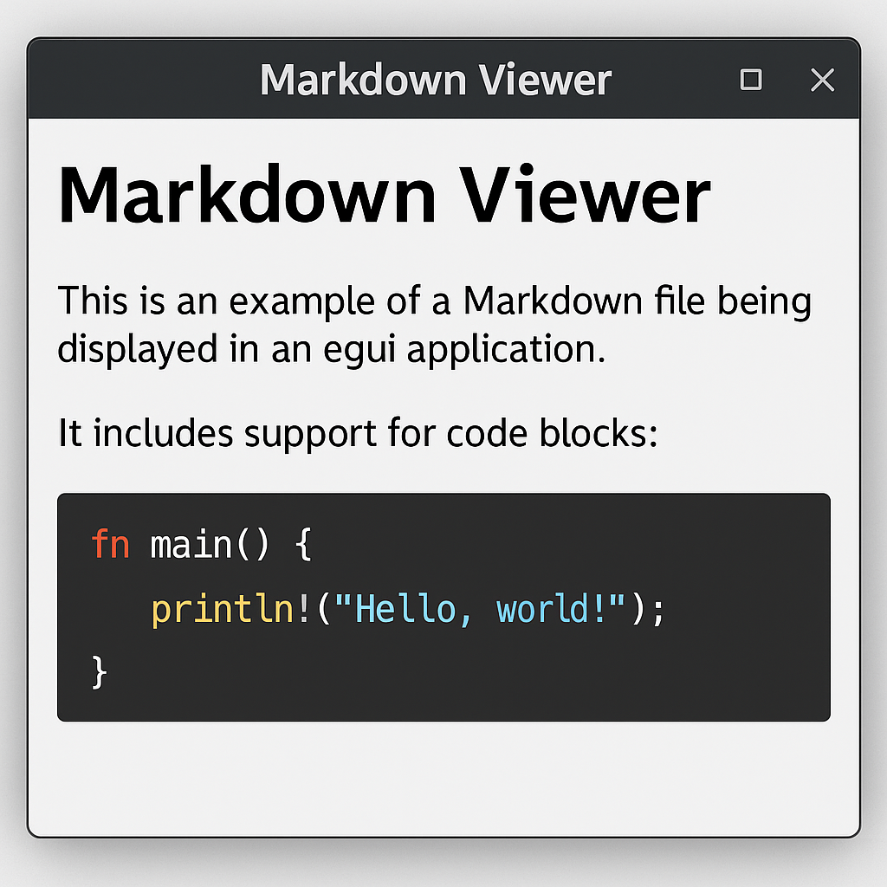

# Hello World

## Subheading

### H3
```rust
fn tell() -> () {
    println!("Hello World")
}
```

| Column 1 | Column 2 | Column 3 |
|----------|----------|----------|
| Cell 1   | Cell 2   | Cell 3   |
| Row 2    | Data     | More     |
| Row 3    | Values   | Content  |

### Lists

- Unordered list item 1
- Unordered list item 2
  - Nested item 2.1
  - Nested item 2.2
- Unordered list item 3

1. Ordered list item 1
2. Ordered list item 2
   1. Nested ordered item 2.1
   2. Nested ordered item 2.2
3. Ordered list item 3

### Text Formatting

*This text is italicized*
**This text is bold**
***This text is bold and italicized***
~~This text is strikethrough~~

### Links and Images

[Visit GitHub](https://github.com)


<h3>est</h3>

### Blockquotes

> This is a blockquote
> It can span multiple lines
>> And can be nested

### Code

Inline `code` looks like this
